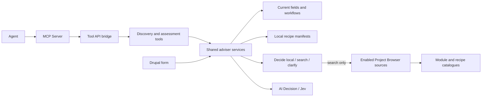

# AI Site Advisor

Help site builders and agents decide what to reuse, investigate or build on a Drupal site.
The adviser reads the current site structure, identifies capabilities in a
brief, decides whether ecosystem searches would help, and returns a draft plan
grounded in the site and discovered recipe/module candidates.
The phase-one demo uses **Jev through the TypeSafe AI provider**.

A site builder can inspect the same advice in a normal Drupal form. Optional
submodules connect Project Browser, Tool API and MCP Server. The main service
works independently of those integrations and of Canvas, WebMCP and ECA.

For example: “We need an editorial workflow for our existing news content.
What can we reuse here, which ecosystem solutions should we investigate, and
what would remain to build?” The adviser compares actual moderation states,
transitions and assigned content types with discovered recipes and modules.
It works whether the existing workflow came from a recipe, a site builder or
custom code. Recipe application history is not required.

This is read-only advice. A relevance judgment is not a compatibility check or
permission to install. No recipe is applied, package installed, content created
or configuration changed by either adviser tool. Phase one includes software
tests and live checks; model evals and cost comparisons remain later work.

## Architecture walkthrough

For a visual explanation of the brief-to-plan pipeline, open the standalone
[architecture animation](docs/architecture/index.html). It walks through site
inspection, source-phrase selection, discovery, typed Jev judgments and the
human/agent handoff. [Recording and export instructions](docs/architecture/README.md)
include a reproducible silent MP4 and GIF renderer. The animation is illustrative;
it does not call a provider or change the site.

## Requirements and standalone installation

- PHP 8.3+, Drupal 11.2+ within Drupal 11, and core Node.
- Symfony String `^7.3` for English singularization (declared in Composer).
- [Drupal AI](https://www.drupal.org/project/ai) `^1.5@RC`.
- [AI Decision](https://www.drupal.org/project/ai_decision) `^1.0@dev`.
- A configured default **Decision** provider and model in Drupal AI.

This directory is a self-contained module with its own Composer metadata and
license. Until it has a published release, place it at
`web/modules/contrib/ai_site_advisor`, or use a Composer path/VCS repository.
From the Drupal project root:

```sh
composer require 'drupal/ai:^1.5@RC' 'drupal/ai_decision:^1.0@dev'
drush en ai_site_advisor -y
```

For Jev, install
[AI Provider TypeSafe AI](https://www.drupal.org/project/ai_provider_typesafeai):

```sh
composer require 'drupal/ai_provider_typesafeai:^1.0@dev'
drush en ai_provider_typesafeai -y
```

Configure its credential through Drupal Key and choose the Jev model as the
default **Decision** model. Credentials and provider configuration are never
shipped with this module. Pin development dependencies in the host site's lock
file; tested versions are recorded in [VALIDATION.md](VALIDATION.md).

Grant `access ai site advisor` to trusted site builders. It permits structural
metadata inspection, configured catalogue searches and provider calls.

- Adviser: `/admin/structure/ai-site-advisor` (Structure → AI Site Advisor).
- Policy, content-type scope and additional recipe directories:
  `/admin/config/ai/site-advisor`.
- Optional sample content type: `drush en ai_site_advisor_demo -y` creates a
  regular Workshop node type with description, date, location and capacity.
  Its normal form is `/node/add/advisor_workshop`. It creates no content records.

In DDEV, prefix Composer and Drush commands with `ddev`.

## Dynamic recipe discovery

There is no fixed list of recipe names. The local source discovers `recipe.yml`
files from:

- Drupal core's `core/recipes` directory.
- Composer packages of type `drupal-recipe`, using their recorded install paths.
- Conventional `recipes` directories at the Composer root and Drupal docroot.
- Additional directories configured in the adviser settings, relative to the
  Composer root or absolute. Directory scans include manifests up to two
  subdirectory levels down and follow links. Add a nearer root for deeper trees.

The source reads names, descriptions, declared extensions, included recipe names,
configuration-action targets and a source hash. It also reads a sibling
`composer.json` for package identity when present. A newly added or edited
manifest appears on the next discovery call without editing this module.
Malformed manifests are reported while valid results remain available.

For local recipes it also inspects `config/*.yml` and explicitly named imports
and action targets. Only structural metadata is retained: configuration names,
labels, entity/bundle/field identifiers, field types, required flags and file
hashes. Arbitrary settings, defaults, action arguments and credentials are not
exported. Each explicit name is checked against active configuration. Existence
does not establish matching settings or application history. Included recipes,
wildcard imports and action behavior still require inspection; this is not a
complete recipe simulation.

Local availability means **code is present**. It does not prove that a recipe
was applied, that its configuration remains in use, or that applying it would
be compatible. The site collector separately reads current configuration.

## Core and existing module capabilities

The adviser reads visible module metadata from Drupal's extension list. Every
module shipped with core is considered even when disabled; enabled contributed
and custom modules are also included. Hidden and test modules are excluded.
Names and descriptions come from the modules themselves. There is no list mapping
planning keywords to specific projects.

An independent semantic screening stage compares each module with the complete
brief. Only a confidently unrelated result (at least 75% probability and 70%
confidence) excludes it from detailed comparison. Useful and uncertain modules
remain named candidates, with starting-point and contribution judgments for each
work area. The full screening results, including exclusions, are inspectable in
**Local capability screening**. These prototype thresholds are not calibrated
coverage guarantees.

This lets core capabilities such as Content Translation and Views participate
alongside recipes and external projects. The starting-point question distinguishes
creating records from adding behavior to those records. For example, an event
content type is not automatically the best choice for translating existing events
or building an overview of them.

Local modules carry their machine name, core/contributed identity, enabled state,
declared dependencies and accessible configuration links. Links come from module
configure routes and registered configuration entities. A disabled core module
needs enabling and configuration, **not Composer acquisition**. For extensions
without a declared Drupal project, `local/<module>` is a local identity, not an
installable Composer recommendation. Available code does not establish configured
languages, translatable fields, listing filters or operational access behavior.

The inventory is collected fresh and included in the site fingerprint. Scoring
packets retain module descriptions and dependencies but omit duplicate inventories
and output-only routes/source paths. The complete result keeps that evidence.
Screening adds provider work, reported separately under `local_discovery`; the
normal three-option UI and compact MCP handoff still apply.

## Discovering the ecosystem through Project Browser

Enable the optional adapter:

```sh
composer require 'drupal/project_browser:^2.1'
drush en ai_site_advisor_project_browser -y
```

The adapter calls Project Browser's public source plugin API and respects its
enabled-source configuration. It accepts recipe and module projects. The built-in
local recipe source is skipped because the main module already reads those
manifests with richer evidence.

Project Browser supplies a contributed-module catalogue. To include recipes
that have **not** been downloaded or applied, the demo uses
[API Browser](https://www.drupal.org/project/api_browser):

```sh
composer require 'drupal/api_browser:^2.0@beta'
drush en api_browser -y
```

At `/admin/config/development/project_browser`, enable **Packagist Drupal
Recipes**, keeping any existing sources you need. API Browser ships this source
configuration; its plugin ID is `api_browser_project:packagist_recipes`.
Use its **API Browser Services** settings to configure other external JSON
catalogues. The adviser has no dependency on Packagist or a particular source ID.
Project Browser's installation UI does not need to be enabled for discovery.

Enter the requirement in the original brief; there is no separate search field.
When an ecosystem adapter is available, Jev receives the brief and current site
structure and chooses one of three paths:

- **Search** when comparing existing solutions would help. Jev selects source
  phrases for several capabilities, such as events, groups and activity stream.
- **Local** when current site/core configuration is a sufficient starting point,
  or the brief explicitly asks to stay local.
- **Clarify** when the requirement or search decision is too uncertain.

Only the search path queries external catalogue adapters. Local recipe files
remain available on every path. The resulting candidates then inform the
assessment stage. Without an ecosystem adapter, the adviser skips
search planning and assesses the local evidence directly.

The form and assessment tool accept **10–20,000 characters**. Named paragraphs
such as `Groups: ...` retain their requirements together. Other prose is split
at punctuation and common conjunctions. Long sections or clauses use overlapping
96-word windows, supplying adjacent one- and two-word source phrases without
discarding the tail. URLs, email addresses and tokens with digits are excluded.
The route and extraction questions run in batches of up to 12 questions, each
with the complete brief and site context. Jev selects a phrase or `none` for
each segment. Every extracted capability is retained; repeated search phrases
merge while preserving their source passages. Compound nouns such as
`activity stream` remain intact; English singularization turns `groups` into
`group` and `events` into `event`. Only the search route sends these terms to
external sources. Local plans retain their capability scope without searching.

No topic-to-module mapping or recipe list is hardcoded. This is bounded source
selection, not arbitrary synonym generation or guaranteed anonymization. The
English clause splitter can miss implicit requirements and complex prose. The
UI reports segments processed and exposes unmapped passages for review. Processing
every segment does not establish that every requirement was understood. Current module
labels/descriptions enrich the site evidence, but do not prove that their
configuration or integrations work.

The result shows the selected path, its predefined criterion and any search
term. Uncertain routes and the absence of a suitable term trigger a review flag
and no ecosystem search. These criteria are static descriptions of the options,
not generated explanations of the model's reasoning.

Discovery reports source IDs, candidate packages, availability, match counts,
truncation and failures. A direct search returns at most 12 candidates,
alternating local and Project Browser results and Project Browser sources.
The adapter fetches up to 24 source results and prefers project-name matches
over incidental description mentions. Compound assessments search each selected
capability separately and retain up to 12 candidates **per query**, deduplicating
shared packages. There is no shared 24-candidate cap on a plan. The assessment
packs questions with their relevant evidence into multiple requests as needed.
Every work-area choice sees all candidates retained for that query. Each
candidate retains its matching queries and each
source report retains its query. These lexical preferences are not semantic
relevance judgments; Jev assesses the retrieved descriptions afterward.
Stable IDs are based on kind and package, with separate core component IDs.
Duplicate packages retain additional source references.

Search is bounded, and upstream sources manage their own caches. A source may
hide upstream fetch failures or provide fixed compatibility flags. Such flags
remain explicitly **unverified source claims**. No results, partial results or
high relevance cannot establish that custom development is necessary or that a
package is safe to adopt. Inspect dependencies, recipe actions, configuration
overlap and target-site compatibility before choosing an installation plan.

## Tool API and MCP Server

Enable Tool API integration:

```sh
composer require 'drupal/tool:^1.0@beta'
drush en ai_site_advisor_tool -y
```

| Tool API plugin | Input | Output |
| --- | --- | --- |
| `ai_site_advisor:discover_candidates` | `query`: 1–120 characters; optional `detail`: `compact` (default) or `full` | `discovery`: candidate pointers and conditional acquisition steps; no inference call. |
| `ai_site_advisor:assess_content_brief` | `brief`: 10–20,000 characters; optional advanced `catalog_query` override: up to 120; optional `detail`: `compact` (default) or `full` | `assessment`: compact build handoff, or complete evidence with `detail: "full"`. |

The operations are `Read` and `Explain`. Both check `access ai site advisor`
inside the service, including for callers that skip Tool API's access method.

### Compact agent handoff

Both tools default to a compact response. **Callers expecting the previous full
output must now pass `"detail": "full"`.** The output keys `assessment` and
`discovery` are unchanged. PHP services and the Drupal form retain full evidence.
This formatting happens in the Tool API adapter, so MCP and other tool callers
get the same contract without changes to their transports.

The compact assessment (`schema_version: agent-plan-v2`) contains:

- `work_areas`: every identified area, its starting point, configuration links,
  matching existing configuration, candidate references and an unresolved check.
  `parts` maps source requirements to content types or candidate references,
  with `supported`, `partial`, `open` or `check` status and individual review flags.
  `integration_verified` is always false; `assembly_check` identifies work still
  needed to connect and verify the chosen components.
- `candidates`: one entry per retained candidate, with project or manifest
  pointers, availability and conditional acquisition/configuration steps.
- `discovery`: extraction coverage, search truncation and source warnings.
- `needs_review` and individual review flags, plus the site fingerprint.

Each work area keeps up to two candidates for each useful contribution role
(foundation or complement), deduplicated. Only a starting point supported by both
selection and contribution is pinned; otherwise `starting_point` remains undecided.
Checked matches for individual requirements are prioritized, followed by independent
contribution evidence. Every component referenced by a part is included in the
candidate dictionary even if it falls outside the general shortlist.
`other_package_options` counts omitted packages; an empty shortlist does not
prove that no solution exists. Complete alternatives and scores remain available
with `detail: "full"`.

An external candidate includes this conditional acquisition instruction:

```json
{
  "acquire": {
    "action": "composer_require_if_selected",
    "argv": ["composer", "require", "vendor/package"]
  }
}
```

The building agent chooses among alternatives and checks a compatible release
before running Composer in its project environment. This is structured command
data, not an executed command. Packages already available locally instead return
`code_available`; enabled modules and local recipes have separate next steps.
Recipe files do not establish recipe application, and available code does not
establish enabled modules. Unknown package identities require inspection.

The default response omits repeated descriptions, raw questions, fields, score
distributions and provider usage. `detail: "full"` performs a fresh assessment,
not a lookup of a saved report, so results can differ. Formatting reduces the
agent-facing payload; it does not reduce the adviser's internal inference work
or establish a token-cost saving. The current MCP bridge includes the output
in both its text content and `structuredContent`.

### MCP connection

For an MCP client, install
[MCP Server Tool Bridge](https://www.drupal.org/project/mcp_server_tool_bridge)
at a version compatible with your MCP Server installation:

```sh
composer require 'drupal/mcp_server_tool_bridge:^1.0@beta'
drush en ai_site_advisor_mcp -y
drush cr
```

This optional submodule installs two enabled Tool API mappings. The demo uses
MCP Server `2.0.0-beta2` and bridge `1.0.0-beta1`; newer bridge releases require
newer server APIs. Review the host's existing MCP tool mappings when enabling
the bridge: other installed modules can supply optional mappings of their own.
This module owns only its two adviser mappings.

The default MCP HTTP endpoint is `/mcp`. Use the host's configured authenticated
MCP connection and an account with both `access mcp server` and `access ai site
advisor`. This module does not provision credentials or anonymous access. The
verified wire names are:

- `tool_api__ai_site_advisor_discover`
- `tool_api__ai_site_advisor_assess`

Manage these mappings at `/admin/config/services/mcp-server/tools`. On the local
demo, MCP Server currently authenticates HTTP requests through a Drupal login
session. Adding the endpoint URL to a desktop MCP client does not establish that
session; configure a supported authentication method for the chosen client
before testing there. The server's OAuth companion is a separate integration,
not enabled automatically by this module. The Decision provider credential
stays in Drupal and is not needed in the MCP client.

An agent can send the original brief directly to assessment:

```json
{
  "brief": "We need an editorial workflow for our existing news content. Writers save drafts, editors review them, then publish approved articles. Compare the existing configuration with available solutions before proposing custom development."
}
```

The service handles search planning for both the form and Tool API/MCP. A caller
that already knows the desired search can use discovery with
`{"query":"workflow"}` without an inference call. Supplying the optional
`catalog_query` to assessment explicitly requests that search and bypasses the
planning stage; normally omit it.

Assessment reads the site and discovers candidates afresh. It never accepts an
agent-supplied evidence packet as proof. Candidate IDs are stable; the set may
change when a source updates. Resolve review flags and inspect candidate details
before invoking separate installation or build tools.



ECA, WebMCP and other callers can use the same service or Tool API plugins through
their adapters. WebMCP can invoke them directly; it does not need MCP Server.
Browser path scope, human handover, transport authentication and write-tool
permissions remain responsibilities of those interfaces.

## A short demo

Select **A community site** and click **Propose a plan**. The example asks for
events and topics in groups, an activity stream and notifications. Show the
separate queries, the existing Workshop type as a possible event starting point,
and `drupal/group` as a discovered candidate. Activity-stream and notification
options remain reviewable; a package's description does not prove the combination
works. The brief should distinguish discussions from taxonomy when asking for
topics. No project name is embedded in the example or retrieval logic.

The plan has three parts: work areas with evidence and open decisions, validation
of the chosen combination, and preparation of build tasks. Work areas follow the
brief; they are not a verified dependency graph. Candidate descriptions come
from sources. Actions and checks are predefined text composed from typed choices,
not an LLM-generated implementation narrative. A work area leads with a
**Recommended starting point** only when its selection and contribution both pass
the review policy. Otherwise it shows **No recommendation yet**, while useful
components and requirement matches remain visible. The original preference and
all scores stay in the expanded evidence, including weak or conflicting choices.

The main view highlights at most **three distinct options**, including any
recommended existing content type. A confirmed choice leads. Checked matches for
specific requirement parts come next; other resources are ordered by contribution
review status, contribution probability and
confidence, with a stable ID tie-break. They are labelled as alternative
foundations or supporting options. Their separate starting-point probability
does not exclude an independently useful addition. Every assessed option remains
available in **Options, scores and remaining gaps**, including existing content
types, Drupal configuration, uncertain packages and unrelated matches.
This limit affects resource highlights, not the requirement breakdown. Every
source part remains available even when its component is outside those cards.

The plan now separates three different judgments:

- **Starting point**: one competing Choice across the inspected options. Its
  probability can be low for a useful module when an existing content type is
  preferred. Weak preferences remain in the evidence without leading the ranking.
- **Contribution here**: an independent Choice for each option in each work area:
  possible foundation, possible addition, unrelated or insufficient evidence.
  Several building blocks can be useful. The role's distribution, confidence,
  criterion and review flag are available beside its source evidence.
- **Whole-brief relevance**: the earlier independent package relevance question,
  explicitly labelled as applying to the complete brief. A package can be useful
  elsewhere without contributing to this particular work area.

Foundation and addition summaries suggest investigation paths. They do not assert
that the packages integrate. For example, a module that supplies its own event
entities may be an alternative foundation to a Workshop node type, while a
field-oriented recurrence module may extend an existing model. The adviser uses
retrieved descriptions to judge this distinction; it does not contain package
rules or automatically install combinations. Roles needing review are identified
in the summary and table. Missing evidence and runtime compatibility remain open.
The same structured `plan`, full option list and judgments are available to MCP
with `detail: "full"`; the default agent handoff is compact.

### Several components for one work area

`RequirementPlanner` adds a separate `requirement-parts-v1` stage after candidate
assessment. It copies sentences and list items from each work area's original
source text; no feature-to-module map is embedded. Jev classifies each item and
selects a possible component from that area's inspected options, including existing
node types, local modules and discovered packages. A second call independently
checks that selected component against the exact item using its description,
actual bundle fields and any inspected recipe configuration.

For example, storing an opening post and adding replies are separate needs.
They can point to an existing record model and a reply capability, while club
access remains a condition to verify. A named component can serve several parts.
Different record models remain alternatives; this is not an install-all list.

Each part reports direct source support, a partial building block, an open gap
or an acceptance check. The `supported` status requires a direct judgment passing the
existing 75% probability / 70% confidence policy. If the combined probability of
direct or partial support is at least 75%, a match can remain **partial** even
when the distinction between those two roles is uncertain. Partial matches always
need review. These are prototype thresholds, not calibrated correctness claims.
An uncertain choice between two viable candidates does not erase independently
supported usefulness, but its selection review flag is preserved.

The service reports this under `plan.areas.*.requirements` and keeps version,
answers, requests and usage under `requirement_plan`. Usage totals include both
new passes under `requirement_planning`, including any targeted recovery. Valid
earlier assessments are not rerun. All request-size and response checks still apply.

This is a source-based breakdown, not exhaustive semantic extraction: one sentence
may contain several needs, and candidate metadata may not establish their coverage.
Such items stay partial or open. Integration, entity compatibility, field wiring
and access behavior across components still require inspection and testing; this
stage never marks a combination verified. It uses the area's bounded candidate
set, so cross-area dependencies can still require broader discovery.

### A handoff for site builders

The default view presents readable next steps; probabilities remain in the
expandable evidence table. `plan.areas.*.handoff` contains the same guidance in
the service response and the full Tool API/MCP response:

- A concrete starting point and an explanation of what remains undecided.
- A suggested administration area, selected from Drupal's registered config
  entity definitions. Its collection/edit/Field UI links are generated from
  actual routes and checked against the caller's access.
- Existing bundle definitions and configurable fields, including non-node
  bundles discovered through entity metadata. The node scope setting is retained.
- Recipe configuration names already present versus proposed additions, with
  direct links to matching current bundle definitions. When all explicitly
  listed names exist, the recipe is presented as a reference to review.
- Project details for remote candidates and a clear distinction between
  enabled modules, locally available recipes and catalog-only resources.

The former “Configure Drupal” option is now explicitly an unspecified approach,
not a competing component or a scored foundation. A named recipe can supply
the same configuration. This fallback always needs review; it never establishes
an implementation on its own.

Jev selects configuration areas and judges candidates. Human-authored interface
copy composes those judgments with current evidence; there is no scenario-to-
module mapping or generated configuration URL. The prose does not invent field
names, integrations or installation instructions. Where the evidence cannot
establish the exact change, the handoff tells the builder what to inspect and
retains the requirement. Applying recipes, simulating their effects and detailed
field-by-field implementation design remain separate work.

For the earlier workflow example:

1. Open the adviser and expand **Available capabilities and recipe catalog**.
   Show the site's actual fields, moderation states and discovered local files.
2. Select **Editorial workflow** and click **Propose a plan**. Show Jev's
   search decision and selected term above the results. In the live check it
   selected `workflow` from the brief and queried the configured sources.
3. Compare the existing workflows with the discovered recipe/module cards.
   Expand a workflow to inspect its transitions and content-type assignments.
4. Expand a candidate's **Evidence and adoption checks**. A remote recipe is
   shown as available in the ecosystem; its presence is not called “applied”.
5. Inspect **Which sources were searched?** and the exact questions and evidence.
   Explain that Jev judges fit from supplied facts; it does not discover Drupal
   projects from memory or decide installation permissions.
6. Try **Recurring workshops**, then **An unclear brief** to demonstrate when
   an ecosystem search may add nothing or the requirement needs clarification.
7. In an MCP agent, ask: “Use the adviser to assess our news workflow requirement.
   Compare what we have with available solutions before proposing custom work.
   Do not install or change anything yet.” Only the original brief is required.

The site must have a moderation workflow for the reuse part of this example.
Without one, discovery still works and the result reports no existing workflow.
The Workshop and campaign examples remain available for content-model planning.
Live judgments vary; the UI shows predefined criteria and review flags rather
than inventing a generated explanation.

For a longer exercise, paste [the detailed community brief](docs/community-planning-brief.txt).
It covers groups, events, discussions, an activity stream, notifications, search,
media, moderation and translation. This is a sample requirement document, not
a fixed catalogue or a model-quality benchmark.

## Service contract and evidence

Inject `Drupal\ai_site_advisor\Assessment\SiteAdvisorInterface`, or service
`ai_site_advisor.advisor`:

```php
$assessment = $advisor->assess($brief, $account);
```

For discovery alone, inject `ai_site_advisor.candidates`:

```php
$discovery = $catalog->discover('workflow', $account, limit: 12);
```

| Assessment key | Meaning |
| --- | --- |
| `status`, `summary`, `follow_up` | Advisory outcome and unresolved questions; never authorisation to build. |
| `answers` | Choices, full distributions, confidence, individual review flags and static criteria. |
| `reuse_candidates`, `extension_candidates` | Confidently matched node content-type IDs. |
| `workflow_candidates` | Existing workflow IDs with a `ready` or `extend` judgment. |
| `adoption_candidates` | Confidently relevant local-module and catalogue candidate IDs, not verified install targets. |
| `local_discovery` | Semantic screening of shipped core and enabled local modules: retained candidates, every screening judgment, questions and usage. |
| `site`, `candidates`, `discovery` | Exact evidence, site fingerprint, source reports and search boundaries. |
| `plan` | Draft work areas, visible preferred selections, every assessed option with separate contribution/selection/brief-relevance judgments, foundation/addition investigation paths, checks and handoff boundaries. |
| `search_plan` | Route, capabilities, queries, unmapped clauses, segment coverage and planning questions/answers (`ecosystem-search-v4`). `query` remains the first term for compatibility; `terms_truncated` is false after successful extraction. |
| `questions`, `profile` | Reviewed questions and versioned rubric (`content-planning-v7`). |
| `model`, `usage`, `usage_by_stage`, `elapsed_ms` | Assessment model, summed provider usage, per-stage usage and elapsed server time including planning/discovery. |
| `requests_by_stage` | Model, question IDs, evidence IDs, compact bytes and reported usage for every provider request. |
| `build_guidance`, `limitations`, `contradictory_judgments` | Boundaries callers must retain. |

`recipes` remains an alias of `candidates`, and candidate question IDs retain
the `recipe__` prefix for compatibility with the initial prototype. These now
include module candidates; inspect each candidate's `kind`. Local module IDs
use `module__<machine_name>`, so core modules remain separate choices despite
sharing `drupal/core`. A discovered project representing the same local module
is coalesced in the comparison; the raw catalogue result remains in `discovery`.

Collected evidence is allowlisted: node-type labels/descriptions, title and
configurable field definitions, reference targets, selected enabled features,
Views/template identities, active moderation states/transitions/bundles and site
policy, plus enabled module names/descriptions. Node content, user records,
provider settings and arbitrary config are
not collected. Role permissions, notifications, ECA models and runtime behavior
are not inferred from workflow labels.

The brief and selected structural metadata go to the configured Decision
provider for search planning; the assessment also includes bounded candidates.
Catalogue sources receive the selected search term (or explicit override),
not site evidence or the full brief. Drupal's normal form/session
handling and host AI logging/cache settings still apply. This module sanitizes
provider exceptions before they reach Tool API or MCP transport logs.

Independent questions are batched within each stage. With an ecosystem adapter,
planning precedes discovery and assessment; each stage may make multiple Decision
requests. Valid global content-model and presentation answers are reused throughout
the assessment.
Candidate relevance needs its source description; a work-area choice sees the
matching candidates and the complete brief. Evidence is repacked when a full
plan would exceed the per-request limit, without dropping questions or candidates.
Independent `role__<work-area>__<option>` questions assess potential contributions
within that work area. They run in the assessment stage and increase reported
usage; the starting-point distribution is not reused as a relevance score.
Local module screening precedes detailed assessment, including when no ecosystem
adapter is installed. Its usage and requests are recorded as `local_discovery`.
`usage` sums all requests; `usage_by_stage` preserves the breakdown. Unknown counts stay
`null` rather than being treated as zero. An explicit search override skips
planning, as does a site without a remote adapter.

If a normalized response has missing answers, mismatched options, an invalid
distribution total or a selected option below the highest score, the adviser
retries only the affected questions once. Evidence and criteria stay identical;
valid answers (including uncertain ones) are kept. Scores are never repaired
or normalized locally. A second invalid response rejects the entire plan.
Provider execution errors still stop immediately. `requests_by_stage` records
each attempt and `rejected_answers` reason codes; usage includes rejected
attempts and recovery. Persistent contract failures log only reason counts,
without provider responses or site evidence.

The page presents site reuse within each work area's plan and configuration
links. There is no separate "What the advisor can see" panel or extra site scan
when the form rebuilds. Removing that panel does not narrow assessment evidence.

Evidence is collected afresh; the adviser does not cache assessments. The
provider may cache its own responses, including their usage metadata. Reported tokens are **not necessarily
newly billed tokens for this call**, and elapsed time is not a full agent-task
measurement. Unknown usage remains `null`; cached-input/billing breakdown is not
available through this response contract.

These are module resource limits, not claims about Jev's context window:

- A brief is at most 20,000 characters; automatic extraction accepts up to 200
  text segments. An over-limit brief is rejected before inference, never clipped.
- Extraction batches contain up to 12 questions; assessment batches up to 48.
  Each compact UTF-8 JSON request is at most 100,000 bytes. Larger plans use
  additional requests. A single oversized evidence packet fails explicitly.
- A keyword sent to a catalogue is at most 120 characters. It is a short search
  phrase selected from the brief, not the planning brief itself.
- Each query has up to 12 retained candidates from bounded source pages. Search
  coverage is still limited and is reported separately from extraction coverage.
- Site inspection supports at most 24 selected node types; narrow the scope in
  settings for larger sites. This is independent of brief length.

The constants are in `BriefCapabilities` and `DecisionBatch`; batching is an
implementation detail, not a request for the site builder to split ordinary
briefs manually. Longer plans increase latency and provider usage. This remains
a synchronous prototype; very large planning jobs need a resumable background
workflow rather than unbounded request limits. Display formatting is not included
in request size checks. Missing answers and invalid options/distributions stop
assessment if targeted recovery fails; denied access and failed inference stop
immediately. Review flags use probability below 0.75, confidence below 0.7,
unknown/unclear answers or contradictory primary judgments. These are prototype
display thresholds, not calibrated correctness guarantees. Callers must retain
individual review flags even when the overall status is `assessed`.

## Extending and validating

The collector, search planner, profile, provider adapter, adviser and UI are
separate classes. Replace the planner through `SearchPlannerInterface`, decorate
the collector or replace the adviser through their interfaces. Add a
catalogue adapter by implementing `CatalogSourceInterface` and tagging its
service `ai_site_advisor.catalog_source`. No procedural `.module` file is needed.
Keep rubric changes versioned. New entity types, package compatibility checks,
approved installation workflows and model evals are separate follow-up work.

Run from a Drupal project with development tools and the optional integration
dependencies installed:

```sh
SIMPLETEST_DB=sqlite://localhost/:memory: vendor/bin/phpunit \
  -c web/modules/contrib/ai_site_advisor/phpunit.xml.dist
vendor/bin/phpcs --standard=Drupal,DrupalPractice --extensions=php \
  web/modules/contrib/ai_site_advisor
node --check web/modules/contrib/ai_site_advisor/js/advisor.js
```

Adjust `contrib` to `custom` as needed. Tests use an isolated SQLite database,
real local manifests and a fixture Project Browser source. They make no external
catalogue or inference requests and require no API key. See
[VALIDATION.md](VALIDATION.md) for verified behavior and live MCP/browser checks.

## Attribution and license

Original integration code, GPL-2.0-or-later. It consumes Drupal core, Drupal AI,
AI Decision, the TypeSafe provider and optional
[Tool API](https://www.drupal.org/project/tool),
[Project Browser](https://www.drupal.org/project/project_browser),
[API Browser](https://www.drupal.org/project/api_browser),
[MCP Server](https://www.drupal.org/project/mcp_server) and
[MCP Server Tool Bridge](https://www.drupal.org/project/mcp_server_tool_bridge)
through their APIs and configuration.

No upstream module was forked or vendored for this work. Recipe manifests are
read from the host installation; API Browser supplies the Packagist source
configuration. Symfony String supplies the English inflector. The optional
Workshop configuration belongs to this module.
Please retain these upstream attributions when contributing or adapting it.
