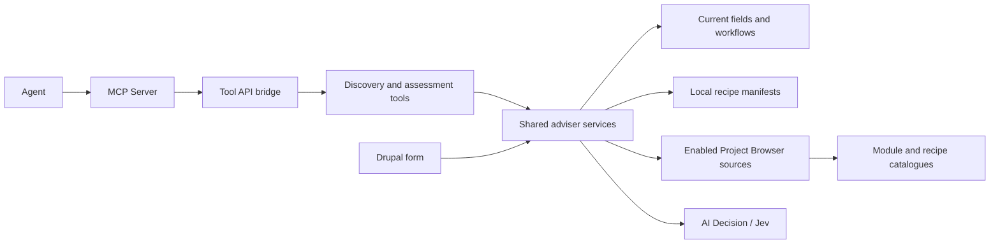

# AI Site Advisor

Help an agent decide what to reuse, investigate or build on a Drupal site.
The adviser reads the current site structure, discovers recipe and module
candidates, then asks typed AI Decision questions about their suitability.
The phase-one demo uses **Jev through the TypeSafe AI provider**.

A site builder can inspect the same advice in a normal Drupal form. Optional
submodules connect Project Browser, Tool API and MCP Server. The main service
works independently of those integrations and of Canvas, WebMCP and ECA.

For example: “We need an editorial workflow for our existing news content.
What can we reuse here, which ecosystem solutions should we investigate, and
what would remain to build?” The adviser compares actual moderation states,
transitions and assigned content types with discovered recipes and modules.
It works whether the existing workflow came from a recipe, a site builder or
custom code. Recipe application history is not required.

This is read-only advice. A relevance judgment is not a compatibility check or
permission to install. No recipe is applied, package installed, content created
or configuration changed by either adviser tool. Phase one includes software
tests and live checks; model evals and cost comparisons remain later work.

## Requirements and standalone installation

- PHP 8.3+, Drupal 11.2+ within Drupal 11, and core Node.
- [Drupal AI](https://www.drupal.org/project/ai) `^1.5@RC`.
- [AI Decision](https://www.drupal.org/project/ai_decision) `^1.0@dev`.
- A configured default **Decision** provider and model in Drupal AI.

This directory is a self-contained module with its own Composer metadata and
license. Until it has a published release, place it at
`web/modules/contrib/ai_site_advisor`, or use a Composer path/VCS repository.
From the Drupal project root:

```sh
composer require 'drupal/ai:^1.5@RC' 'drupal/ai_decision:^1.0@dev'
drush en ai_site_advisor -y
```

For Jev, install
[AI Provider TypeSafe AI](https://www.drupal.org/project/ai_provider_typesafeai):

```sh
composer require 'drupal/ai_provider_typesafeai:^1.0@dev'
drush en ai_provider_typesafeai -y
```

Configure its credential through Drupal Key and choose the Jev model as the
default **Decision** model. Credentials and provider configuration are never
shipped with this module. Pin development dependencies in the host site's lock
file; tested versions are recorded in [VALIDATION.md](VALIDATION.md).

Grant `access ai site advisor` to trusted site builders. It permits structural
metadata inspection, configured catalogue searches and provider calls.

- Adviser: `/admin/structure/ai-site-advisor` (Structure → AI Site Advisor).
- Policy, content-type scope and additional recipe directories:
  `/admin/config/ai/site-advisor`.
- Optional sample content type: `drush en ai_site_advisor_demo -y` creates a
  regular Workshop node type with description, date, location and capacity.
  Its normal form is `/node/add/advisor_workshop`. It creates no content records.

In DDEV, prefix Composer and Drush commands with `ddev`.

## Dynamic recipe discovery

There is no fixed list of recipe names. The local source discovers `recipe.yml`
files from:

- Drupal core's `core/recipes` directory.
- Composer packages of type `drupal-recipe`, using their recorded install paths.
- Conventional `recipes` directories at the Composer root and Drupal docroot.
- Additional directories configured in the adviser settings, relative to the
  Composer root or absolute. Directory scans include manifests up to two
  subdirectory levels down and follow links. Add a nearer root for deeper trees.

The source reads names, descriptions, declared extensions, included recipe names,
configuration-action targets and a source hash. It also reads a sibling
`composer.json` for package identity when present. A newly added or edited
manifest appears on the next discovery call without editing this module.
Malformed manifests are reported while valid results remain available.

Local availability means **code is present**. It does not prove that a recipe
was applied, that its configuration remains in use, or that applying it would
be compatible. The site collector separately reads current configuration.

## Discovering the ecosystem through Project Browser

Enable the optional adapter:

```sh
composer require 'drupal/project_browser:^2.1'
drush en ai_site_advisor_project_browser -y
```

The adapter calls Project Browser's public source plugin API and respects its
enabled-source configuration. It accepts recipe and module projects. The built-in
local recipe source is skipped because the main module already reads those
manifests with richer evidence.

Project Browser supplies a contributed-module catalogue. To include recipes
that have **not** been downloaded or applied, the demo uses
[API Browser](https://www.drupal.org/project/api_browser):

```sh
composer require 'drupal/api_browser:^2.0@beta'
drush en api_browser -y
```

At `/admin/config/development/project_browser`, enable **Packagist Drupal
Recipes**, keeping any existing sources you need. API Browser ships this source
configuration; its plugin ID is `api_browser_project:packagist_recipes`.
Use its **API Browser Services** settings to configure other external JSON
catalogues. The adviser has no dependency on Packagist or a particular source ID.
Project Browser's installation UI does not need to be enabled for discovery.

Use short keywords such as `workflow` in the adviser's **Search the ecosystem
for** field. The API Browser Packagist source currently filters titles, so a
paragraph-length requirement is a poor search query. An agent can try a second
term when the first search is narrow. An empty search field assesses local
recipes only; it does not send the full brief to catalogue providers.

Discovery reports source IDs, candidate packages, availability, match counts,
truncation and failures. Searches assess at most 12 candidates, alternating
local and Project Browser results and alternating Project Browser sources.
Stable IDs are based on kind and package, with separate core component IDs.
Duplicate packages retain additional source references.

Search is bounded, and upstream sources manage their own caches. A source may
hide upstream fetch failures or provide fixed compatibility flags. Such flags
remain explicitly **unverified source claims**. No results, partial results or
high relevance cannot establish that custom development is necessary or that a
package is safe to adopt. Inspect dependencies, recipe actions, configuration
overlap and target-site compatibility before choosing an installation plan.

## Tool API and MCP Server

Enable Tool API integration:

```sh
composer require 'drupal/tool:^1.0@beta'
drush en ai_site_advisor_tool -y
```

| Tool API plugin | Input | Output |
| --- | --- | --- |
| `ai_site_advisor:discover_candidates` | `query`: 1–120 characters | `discovery`: candidates and source reports; no inference call. |
| `ai_site_advisor:assess_content_brief` | `brief`: 10–4,000 characters; optional `catalog_query`: up to 120 | `assessment`: fresh site evidence, discovery and typed judgments. |

The operations are `Read` and `Explain`. Both check `access ai site advisor`
inside the service, including for callers that skip Tool API's access method.

For an MCP client, install
[MCP Server Tool Bridge](https://www.drupal.org/project/mcp_server_tool_bridge)
at a version compatible with your MCP Server installation:

```sh
composer require 'drupal/mcp_server_tool_bridge:^1.0@beta'
drush en ai_site_advisor_mcp -y
drush cr
```

This optional submodule installs two enabled Tool API mappings. The demo uses
MCP Server `2.0.0-beta2` and bridge `1.0.0-beta1`; newer bridge releases require
newer server APIs. Review the host's existing MCP tool mappings when enabling
the bridge: other installed modules can supply optional mappings of their own.
This module owns only its two adviser mappings.

The default MCP HTTP endpoint is `/mcp`. Use the host's configured authenticated
MCP connection and an account with both `access mcp server` and `access ai site
advisor`. This module does not provision credentials or anonymous access. The
verified wire names are:

- `tool_api__ai_site_advisor_discover`
- `tool_api__ai_site_advisor_assess`

An agent can first call discovery with `{"query":"workflow"}`, then assess:

```json
{
  "brief": "We need an editorial workflow for our existing news content. Writers save drafts, editors review them, then publish approved articles. Compare the existing configuration with available solutions before proposing custom development.",
  "catalog_query": "workflow"
}
```

Assessment repeats discovery and reads the site afresh. It never accepts an
agent-supplied evidence packet as proof. Candidate IDs are stable; the set may
change when a source updates. Resolve review flags and inspect candidate details
before invoking separate installation or build tools.



ECA, WebMCP and other callers can use the same service or Tool API plugins through
their adapters. WebMCP can invoke them directly; it does not need MCP Server.
Browser path scope, human handover, transport authentication and write-tool
permissions remain responsibilities of those interfaces.

## A short demo

1. Open the adviser and expand **Available capabilities and recipe catalog**.
   Show the site's actual fields, moderation states and discovered local files.
2. Select **Editorial workflow** and click **Assess this brief**. This searches
   the configured ecosystem for `workflow` as well as reading local manifests.
3. Compare the existing workflows with the discovered recipe/module cards.
   Expand a workflow to inspect its transitions and content-type assignments.
4. Expand a candidate's **Evidence and adoption checks**. A remote recipe is
   shown as available in the ecosystem; its presence is not called “applied”.
5. Inspect **Which sources were searched?** and the exact questions and evidence.
   Explain that Jev judges fit from supplied facts; it does not discover Drupal
   projects from memory or decide installation permissions.
6. In an MCP agent, ask: “Use the adviser to search workflow solutions and assess
   our existing news workflow. Give me a reuse / adopt / custom-build proposal
   with the remaining checks. Do not install or change anything yet.”

The site must have a moderation workflow for the reuse part of this example.
Without one, discovery still works and the result reports no existing workflow.
The Workshop and campaign examples remain available for content-model planning.
Live judgments vary; the UI shows predefined criteria and review flags rather
than inventing a generated explanation.

## Service contract and evidence

Inject `Drupal\ai_site_advisor\Assessment\SiteAdvisorInterface`, or service
`ai_site_advisor.advisor`:

```php
$assessment = $advisor->assess($brief, $account, catalog_query: 'workflow');
```

For discovery alone, inject `ai_site_advisor.candidates`:

```php
$discovery = $catalog->discover('workflow', $account, limit: 12);
```

| Assessment key | Meaning |
| --- | --- |
| `status`, `summary`, `follow_up` | Advisory outcome and unresolved questions; never authorisation to build. |
| `answers` | Choices, full distributions, confidence, individual review flags and static criteria. |
| `reuse_candidates`, `extension_candidates` | Confidently matched node content-type IDs. |
| `workflow_candidates` | Existing workflow IDs with a `ready` or `extend` judgment. |
| `adoption_candidates` | Confidently relevant catalogue candidate IDs, not verified install targets. |
| `site`, `candidates`, `discovery` | Exact evidence, site fingerprint, source reports and search boundaries. |
| `questions`, `profile` | Reviewed questions and versioned rubric (`content-planning-v2`). |
| `model`, `usage`, `elapsed_ms` | Provider-reported model/usage and elapsed server time including discovery. |
| `build_guidance`, `limitations`, `contradictory_judgments` | Boundaries callers must retain. |

`recipes` remains an alias of `candidates`, and candidate question IDs retain
the `recipe__` prefix for compatibility with the initial prototype. These now
include module candidates; inspect each candidate's `kind`.

Collected evidence is allowlisted: node-type labels/descriptions, title and
configurable field definitions, reference targets, selected enabled features,
Views/template identities, active moderation states/transitions/bundles and site
policy. Node content, user records, provider settings and arbitrary config are
not collected. Role permissions, notifications, ECA models and runtime behavior
are not inferred from workflow labels.

The brief, selected structural metadata and bounded candidates go to the
configured Decision provider. Catalogue sources receive the separate search
keywords, not site evidence or the full brief. Drupal's normal form/session
handling and host AI logging/cache settings still apply. This module sanitizes
provider exceptions before they reach Tool API or MCP transport logs.

All independent judgments go in one Decision request. Evidence is collected
afresh; the adviser does not cache assessments. The provider may cache its own
responses, including their usage metadata. Reported tokens are **not necessarily
newly billed tokens for this call**, and elapsed time is not a full agent-task
measurement. Unknown usage remains `null`; cached-input/billing breakdown is not
available through this response contract.

Assessment supports at most 24 selected node types and a 100 KB request. Missing
answers, invalid options/distributions, denied access and failed inference stop
assessment. Review flags use probability below 0.75, confidence below 0.7,
unknown/unclear answers or contradictory primary judgments. These are prototype
display thresholds, not calibrated correctness guarantees. Callers must retain
individual review flags even when the overall status is `assessed`.

## Extending and validating

The collector, profile, provider adapter, adviser and UI are separate classes.
Decorate the collector or replace the adviser through their interfaces. Add a
catalogue adapter by implementing `CatalogSourceInterface` and tagging its
service `ai_site_advisor.catalog_source`. No procedural `.module` file is needed.
Keep rubric changes versioned. New entity types, package compatibility checks,
approved installation workflows and model evals are separate follow-up work.

Run from a Drupal project with development tools and the optional integration
dependencies installed:

```sh
SIMPLETEST_DB=sqlite://localhost/:memory: vendor/bin/phpunit \
  -c web/modules/contrib/ai_site_advisor/phpunit.xml.dist
vendor/bin/phpcs --standard=Drupal,DrupalPractice --extensions=php \
  web/modules/contrib/ai_site_advisor
node --check web/modules/contrib/ai_site_advisor/js/advisor.js
```

Adjust `contrib` to `custom` as needed. Tests use an isolated SQLite database,
real local manifests and a fixture Project Browser source. They make no external
catalogue or inference requests and require no API key. See
[VALIDATION.md](VALIDATION.md) for verified behavior and live MCP/browser checks.

## Attribution and license

Original integration code, GPL-2.0-or-later. It consumes Drupal core, Drupal AI,
AI Decision, the TypeSafe provider and optional
[Tool API](https://www.drupal.org/project/tool),
[Project Browser](https://www.drupal.org/project/project_browser),
[API Browser](https://www.drupal.org/project/api_browser),
[MCP Server](https://www.drupal.org/project/mcp_server) and
[MCP Server Tool Bridge](https://www.drupal.org/project/mcp_server_tool_bridge)
through their APIs and configuration.

No upstream module was forked or vendored for this work. Recipe manifests are
read from the host installation; API Browser supplies the Packagist source
configuration. The optional Workshop configuration belongs to this module.
Please retain these upstream attributions when contributing or adapting it.
