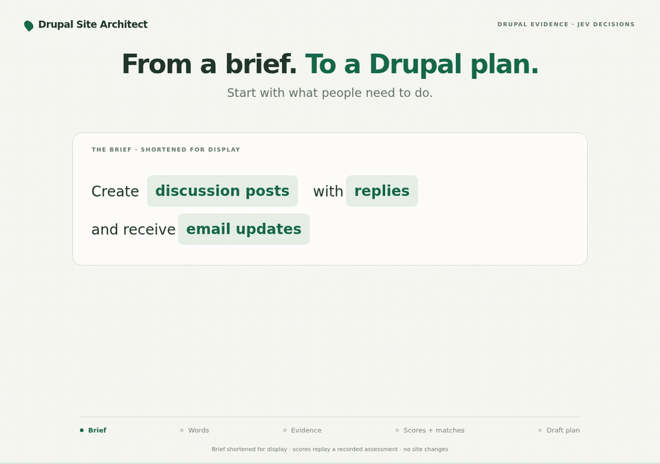

# Drupal Site Architect

Turn a feature brief into a Drupal implementation plan grounded in the current
site. Site Architect inspects existing configuration, discovers modules and
recipes through Project Browser, and uses **Jev** to score what could be reused,
extended or added. The result names building blocks, field connections and work
that still needs a decision.

Review the plan in Drupal or request the same assessment from an agent over MCP.
It provides **read-only planning**: it does not install packages or change content
or configuration. Scores guide review; they do not prove compatibility.

[](docs/architecture/story.html)

## Built on Agent Access

[Agent Access](https://www.drupal.org/project/agent_access) supplies the recipe for
MCP, OAuth and a small starter tool catalog. Site Architect adds two Tool API
tools: **discover Drupal candidates** and **assess a feature brief**.

Composer downloads that base and the planning dependencies together. Applying
the recipe configures the connection; enabling Site Architect registers the
planning tools. Site Architect keeps direct dependencies on the APIs it uses.
No upstream project is forked or copied.

## Install

Requires **Drupal 11.4+ within Drupal 11**, **PHP 8.3+**, a Composer-managed site
and a TypeSafe API key. The commands below use project-local Drush. Agent Access
is currently an alpha recipe; see its [current limits](https://git.drupalcode.org/project/agent_access/-/blob/1.0.x/SECURITY.md).

From the directory containing the site's `composer.json`:

```sh
composer config repositories.site_architect vcs https://github.com/ronaldtebrake/drupal_site_architect.git
composer config repositories.ai_decision vcs https://git.drupalcode.org/project/ai_decision.git
composer config repositories.ai_provider_typesafeai vcs https://git.drupalcode.org/project/ai_provider_typesafeai.git
composer config minimum-stability dev
composer config prefer-stable true
composer require drupal/site_architect:dev-main --with-all-dependencies

vendor/bin/drush --uri=https://your-site.example recipe ../recipes/agent_access
vendor/bin/drush en site_architect -y
vendor/bin/drush cr
```

Replace the example URL with your site's HTTPS address. The GitHub repository
setting discovers this package; the two AI repository settings work around
current upstream packaging metadata. Stability settings apply to the whole
site. [Installation details and existing-site upgrades](docs/installation.md)
explain these requirements and the recipe path.

## Configure and use

1. Add the TypeSafe API key through **Key**, select it at
   `/admin/config/ai/providers/typesafeai`, then choose **TypeSafe AI / Jev** as
   the default **Decision** provider at `/admin/config/ai/settings`.
2. At `/admin/config/development/project_browser`, enable the **Drupal.org** and
   **Packagist Drupal Recipes** sources. Preserve any other sources the site uses.
3. Grant **Use Drupal Site Architect** to the site builders who need planning.
4. Open **Structure → Drupal Site Architect**
   (`/admin/structure/site-architect`), enter a brief and select **Propose a plan**.

For example:

> We want recurring workshops with a date, location, capacity and description.
> Visitors should filter the listing by location. Reuse a suitable existing
> content type and give every workshop a shared layout.

Review the proposed starting point, supporting components and unresolved work.
**Copy plan for an agent** copies the current scored draft for implementation
with your existing tools. Planning policy lives at `/admin/config/ai/site-architect`.

## Use it from an agent

Finish [Agent Access's OAuth setup](docs/agent-access.md): generate keys, grant
the account the required permissions, and connect the agent to
`https://your-site.example/mcp`. For planning, request the scopes
`drupal:mcp:connect` and **`drupal:site-architect:plan`**. Add
`drupal:content:read` if using Agent Access's starter content tools too.

| MCP tool | Input | Result |
| --- | --- | --- |
| `tool_api__site_architect_assess` | `{"brief":"Your feature brief…"}` | Compact scored plan with configuration pointers, candidates and remaining work. |
| `tool_api__site_architect_discover` | `{"query":"workflow"}` | Local and ecosystem candidates, without a model call. |

Both default to compact output. Add `"detail":"full"` for the complete evidence.
[Tool contracts and examples](docs/tools.md) cover other callers, including
WebMCP and ECA. They can use the same Tool API operations through their adapters.

## Explore further

- [Jev comparison: keyword matches versus a connected plan](docs/jev-comparison/README.md)
- [Demo scenarios and the optional Workshop recipe](docs/demo.md)
- [Discovery, site evidence and search limits](docs/discovery.md)
- [Service contracts, extension points and tests](docs/development.md)
- [Performance measurements](docs/performance.md) · [Validation record](VALIDATION.md)

Source: [ronaldtebrake/drupal_site_architect](https://github.com/ronaldtebrake/drupal_site_architect).
Package: `drupal/site_architect`. Module: `site_architect`.
GPL-2.0-or-later; [upstream attribution](docs/attribution.md).
