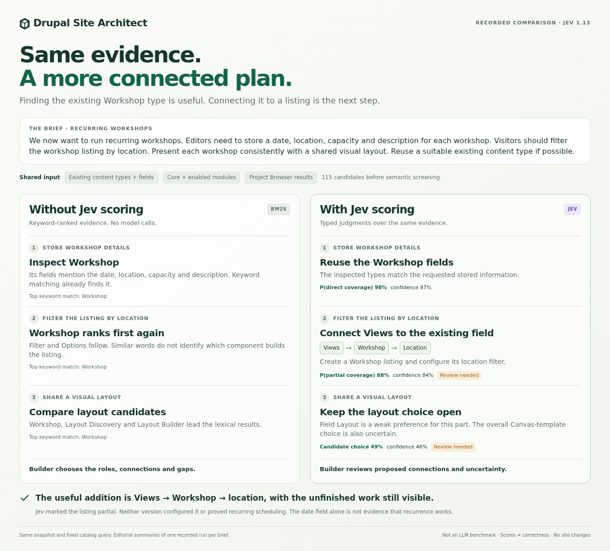

# What changes when Jev's judgments are removed?

**Keyword matching finds useful pieces. Jev helps turn those pieces into a
proposed configuration, with relationships and unresolved choices.** That is the
useful difference in these three recorded examples. It does not make every
suggestion correct, and it does not make a different LLM incapable of planning.

[Open the interactive comparison](index.html) · [Workshop poster](workshops.png)
· [Translation poster](translation.png) · [Discussion poster](discussions.png)



## What we actually compared

On 27 September 2026, we ran three short briefs against the same development
site. Both versions received its actual content types and fields, all 110 visible
core/enabled module descriptions, and the results of a fixed Project Browser/local
recipe search. The shared candidate pools contained 115, 125 and 125 items,
respectively, including the three existing content types.

| | Without Jev scoring | With Jev scoring |
| --- | --- | --- |
| Inspected site and catalog evidence | Same snapshot | Same snapshot |
| Search terms | Declared in advance: `workshop`, `translation`, `notification` | The same terms |
| Candidate handling | BM25 keyword ranking, top three matches for each original sentence | Production semantic screening of local modules, then the production assessment and requirement planners |
| Facts retained | Descriptions, actual fields, package identity and availability | The same facts |
| Additional judgments | None; no invented probabilities or confidence | Component role, target record, field usage, coverage and uncertainty |
| Output | An inspection checklist assembled from keyword matches | A scored draft assembled by the existing application code |

The normal application's automatic search-term selection is bypassed in both
versions. This isolates what the judgment stages add after evidence is available.
The baseline does **not** receive Jev's selected candidates, semantic roles or
scores; it sees the full shared inventory before semantic screening. Capturing
the scored side naturally calls Jev; rebuilding the baseline and visual calls no
model at all.

This is a small comparison with one deliberately simple, documented lexical
baseline. It is not a claim about every implementation without Jev, a comparison
with another LLM, a calibrated accuracy evaluation, or a cost/speed benchmark.
An agent with a strong reasoning model could also interpret this evidence. That
would be a separate experiment using the same inputs and explicit success criteria.

The readable plans below and the cards in the visual are **editorial summaries
of recorded output**, not text generated by Jev or literal screenshots of the
Drupal form. The visual's evidence table preserves every source sentence and
the recorded choices, including weak and awkward ones.

## 1. Workshops: finding a type versus connecting its fields

> We now want to run recurring workshops. Editors need to store a date,
> location, capacity and description for each workshop. Visitors should filter
> the workshop listing by location. Present each workshop consistently with a
> shared visual layout. Reuse a suitable existing content type if possible.

### Without scoring: an inspection checklist

1. Inspect the existing **Workshop** type. Its field metadata contains the
   requested date, location, capacity and description. This is a good keyword
   match; no AI is needed to discover these facts.
2. For the location-filtered listing, inspect **Workshop**, **Filter** and
   **Options**, the three highest lexical matches for that sentence. Decide
   which capability implements the listing and how it uses the stored location.
3. For the shared layout, compare **Workshop**, **Layout Discovery** and
   **Layout Builder**, the highest lexical matches. Choose the presentation
   approach and check it against the records.

These are search results to inspect, not three instructions to enable modules.
The baseline also retains exact field-label overlaps and their types. It does
not establish that a matched field should be used as a filter.

### With scoring: a connected draft

1. Start with **Workshop**. Its date, location, capacity and description fields
   were matched to the requested stored information: P(direct coverage) **98%**,
   confidence **97%**.
2. Use **Views** for the listing, targeting the existing Workshop type. Connect
   its location filter to **`field_workshop_location`**, an inspected string
   field. This is a **partial** solution: P(partial coverage) **88%**, confidence
   **84%**. The view and filter still need to be configured and tested.
3. Keep presentation open. The per-part planner selected **Field Layout** with
   only **49%** probability and **46%** confidence. The separate overall
   presentation question weakly preferred a Canvas template (**43%**, confidence
   **31%**). These do not establish an agreed layout implementation.

The useful added connection is:

**Views → Workshop records → `field_workshop_location` as the filter.**

Existing configuration to inspect:

- `node.type.advisor_workshop`
- `field.field.node.advisor_workshop.field_workshop_location`
- `/admin/structure/types/manage/advisor_workshop/fields`
- `/admin/structure/views`

**A limitation exposed by the run:** the first sentence about recurring workshops
received a direct-coverage judgment. The inspected date field and the content
type's description do not prove automated recurrence. That remains a design and
validation question. We have kept the original judgment in the evidence rather
than quietly correcting its score for this presentation.

## 2. Translation: choosing the right core capability

The brief asks to translate existing article titles and bodies into Dutch and
English, allow readers to switch language, and keep translations on the same
article record.

| Requirement | Without scoring: first lexical match | With scoring: recorded direction |
| --- | --- | --- |
| Translate title/body | Article (WebMCP demo) | **Content Translation** from core; per-part selection 98%, confidence 98%. Coverage remains partial. |
| Readers switch translations | Interface Translation | **Select translation**, but only 28% selection probability and 24% confidence. The item remains open. |
| Keep one record with translations | Layout Builder Asymmetric Translation | **Content Translation**, with partial coverage and further configuration to inspect. |

The resulting draft gives a clearer starting point: investigate core Content
Translation and its Language dependency for the existing articles, then configure
languages and field translation. No separate language-specific content type is
established as necessary.

**The switcher is a weak result, not a success claim.** The supplied description
of Select translation is about choosing a translation through a Views filter.
It does not establish a reader-facing language switcher. The recorded assessment
keeps this item open; a builder should correct or further investigate it before
acting. Core Language's configuration and language-switching facilities are an
appropriate next place to inspect, but that is our review note, not a recorded
recommendation from this run.

## 3. Discussions: separate the record, replies and delivery

The brief asks for topic records with title/body, threaded replies, and optional
email subscriptions when someone replies.

### Without scoring

- **Article (WebMCP demo)** leads for the topic's title/body.
- **Comment** leads for threaded replies. This is already a useful match.
- Three **account-change email recipes** lead for reply notifications:
  `ddr_security_email_notifications_email_changed`,
  `ddr_security_email_notifications_role_changed` and
  `ddr_security_email_notifications_password_changed`.

The builder must distinguish shared email vocabulary from subscription and
reply-trigger behavior, then choose how the pieces connect.

### With scoring

- **Article** is a partial candidate for the opening topic. Reusing an article
  as a discussion topic is still a modeling decision.
- **Comment** is identified for replies, with partial coverage: P(partial)
  **93%**, confidence **91%**. Threading, record attachment and access need
  configuration and testing.
- **Notification System** is a candidate to investigate for subscriptions and
  delivery. Its contribution is judged partial: P(partial) **93%**, confidence
  **90%**. However, the choice of that candidate is weak: **46%** probability,
  confidence **44%**. It is **not** a confirmed recommendation.

That distinction is useful: “this component could supply a piece” and “this is
the best component to select” are separate questions. A high partial-contribution
score does not resolve a weak choice between packages. The overall starting
point in this run also remains under review.

## What this shows, and what it does not

Site inspection and Project Browser supply the facts. They can already tell us
what fields exist, whether module code is present, and what projects describe
themselves as doing. Jev adds proposed interpretations that the application can
use: which field belongs to which need, what operates on that record, where a
component is only a supporting piece, and where the choice should remain open.

The application still owns the questions, thresholds, ranking and plan text.
Jev returns typed judgments; it does not write a free-form implementation plan.
The probability of `partial` is **not** the percentage of a requirement completed.
Confidence describes the distribution of the answer, not verified correctness.
See [TypeSafe's confidence documentation](https://docs.typesafe.ai/confidence).
The distinction between fast retrieval and subsequent relevance judgments is
also illustrated in its [reranking cookbook](https://docs.typesafe.ai/cookbooks/rerank_typesafe);
that cookbook's benchmark results are not results for this Drupal experiment.

These examples establish inspectable behavior, not a quality score. Discovery
was bounded, the site was a demo environment, and no selected configuration or
package combination was installed or tested. The Workshop layout, recurrence,
translation switcher and notification choice are real remaining gaps.

## Reproduce or inspect

- [cases.json](cases.json): complete briefs and fixed search terms, declared
  before running inference. All three captured cases are included.
- [capture.php](capture.php): invokes the existing site inspector, discovery and
  assessment services. It checks that site fingerprints and catalog items match.
  It changes no production code, service definitions, content or configuration;
  ordinary catalog caches and inference logs may be populated.
- [build.mjs](build.mjs): deterministic baseline and allowlisted public export.
  BM25 uses `k1=1.2`, `b=0.75`, lowercasing, a fixed general English stop list and
  simple suffix normalization. Documents contain names, descriptions and actual
  field metadata, with no package-specific weights or hand-picked winners.
  It returns the top three positive matches per original sentence; ties use ID.
  Exact field-label overlaps remain lexical hints, without inferred purposes.
- [results.json](results.json): shared candidate descriptions, source capture
  hashes, site fingerprints, lexical scores and recorded model judgments.
  Jev reported **`jev-1.13.0`**, using profile **`content-planning-v8`**.
  Credentials, provider configuration, content records and raw request logs are
  excluded from the public export.
- [template.html](template.html) and [index.html](index.html): source and generated
  standalone comparison. All three scenarios work offline; no provider is called.

From a Drupal project with a configured Decision provider, use an output directory
outside the web root. These commands make real inference calls using the site's
configured provider. Review captured site metadata before publishing an export.

```sh
mkdir -p /tmp/site-architect-comparison
ARCHITECT_COMPARISON_OUTPUT=/tmp/site-architect-comparison \
  vendor/bin/drush php:script web/modules/contrib/site_architect/docs/jev-comparison/capture.php
node web/modules/contrib/site_architect/docs/jev-comparison/build.mjs \
  /tmp/site-architect-comparison
node web/modules/contrib/site_architect/docs/jev-comparison/render.mjs
```

Existing captures are retained, not overwritten or repeatedly rerun until a
preferred result appears. Use a new output directory for another run. The
renderer uses Node 22+ and Chromium to export one PNG per scenario and check
desktop/mobile layout and interaction. Rendering itself makes no model calls.

## A short explanation to share

> Both versions can find the Workshop content type. What Jev adds is the proposed
> connection: use Views to list those Workshop records, and use the existing
> location field for the filter. The field comes from Drupal's inspected
> configuration; its intended use is a scored judgment. The view still needs
> building, and uncertain choices stay visible. That is the value here: a more
> connected starting plan that a builder or agent can inspect and continue.
