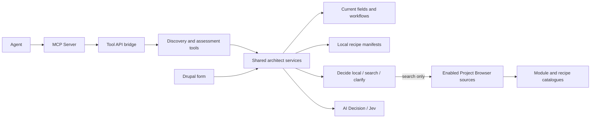

# Tool API and MCP reference

[Back to README](../README.md)

Both plugins are included in the main module. Enabling Site Architect installs
Tool API and registers them automatically.

| Tool API plugin | Input | Output |
| --- | --- | --- |
| `site_architect:discover_candidates` | `query`: 1–120 characters; optional `detail`: `compact` (default) or `full` | `discovery`: candidate pointers and conditional acquisition steps; no inference call. |
| `site_architect:assess_content_brief` | `brief`: 10–20,000 characters; optional advanced `catalog_query` override: up to 120; optional `detail`: `compact` (default) or `full` | `assessment`: compact build handoff, or complete evidence with `detail: "full"`. |

The operations are `Read` and `Explain`. Both check `access site architect`
inside the service, including for callers that skip Tool API's access method.

### Compact agent handoff

Both tools default to a compact response. **Callers expecting the previous full
output must now pass `"detail": "full"`.** The output keys `assessment` and
`discovery` are unchanged. PHP services and the Drupal form retain full evidence.
This formatting happens in the Tool API adapter, so MCP and other tool callers
get the same contract without changes to their transports.

The compact assessment (`schema_version: agent-plan-v2`) contains:

- `work_areas`: every identified area, its starting point, configuration links,
  matching existing configuration, candidate references and an unresolved check.
  `parts` maps source requirements to content types or candidate references,
  with `supported`, `partial`, `open` or `check` status and individual review flags.
  `assessed_preference` retains a weak starting-point choice without promoting it
  to a recommendation. Shortlisted candidates include contribution `evidence`;
  parts include separate component-selection and coverage judgments. Target and
  field references also retain their selected judgment's evidence.
  `integration_verified` is always false; `assembly_check` identifies work still
  needed to connect and verify the chosen components.
- `candidates`: one entry per retained candidate, with project or manifest
  pointers, availability and conditional acquisition/configuration steps.
- `discovery`: extraction coverage, unassigned source passages, search truncation
  and source warnings.
- `needs_review` and individual review flags, plus the site fingerprint.

Compact evidence contains `choice`, its `probability`, `confidence` and
`needs_review`, rather than the full distribution over alternatives. Missing
scores remain `null`. These are separate judgments on a 0–1 scale, not an overall
quality percentage or proof of compatibility. The same numbers are copied from
the assessment; exporting never runs another model call. Use `detail: "full"`
for complete source descriptions, all candidates and score distributions.

Each work area keeps up to two candidates for each useful contribution role
(foundation or complement), deduplicated. Only a starting point supported by both
selection and contribution is pinned; otherwise `starting_point` remains undecided.
Checked matches for individual requirements are prioritized, followed by independent
contribution evidence. Every component referenced by a part is included in the
candidate dictionary even if it falls outside the general shortlist.
`other_package_options` counts omitted packages; an empty shortlist does not
prove that no solution exists. Complete alternatives and scores remain available
with `detail: "full"`.

An external candidate includes this conditional acquisition instruction:

```json
{
  "acquire": {
    "action": "composer_require_if_selected",
    "argv": ["composer", "require", "vendor/package"]
  }
}
```

The building agent chooses among alternatives and checks a compatible release
before running Composer in its project environment. This is structured command
data, not an executed command. Packages already available locally instead return
`code_available`; enabled modules and local recipes have separate next steps.
Recipe files do not establish recipe application, and available code does not
establish enabled modules. Unknown package identities require inspection.

The default response omits repeated descriptions, raw questions, fields, score
distributions and provider usage. `detail: "full"` performs a fresh assessment,
not a lookup of a saved report, so results can differ. Formatting reduces the
agent-facing payload; it does not reduce the architect's internal inference work
or establish a token-cost saving. The current MCP bridge includes the output
in both its text content and `structuredContent`.

### MCP connection

MCP Server and Tool Bridge are installed with Site Architect. The main module
owns two enabled mappings: `tool_api__site_architect_discover` and
`tool_api__site_architect_assess`. Configure the agent's authenticated connection
as described in [Agent Access setup](agent-access.md).
The Decision provider credential remains in Drupal.

An agent can send the original brief directly to assessment:

```json
{
  "brief": "We need an editorial workflow for our existing news content. Writers save drafts, editors review them, then publish approved articles. Compare the existing configuration with available solutions before proposing custom development."
}
```

The service handles search planning for both the form and Tool API/MCP. A caller
that already knows the desired search can use discovery with
`{"query":"workflow"}` without an inference call. Supplying the optional
`catalog_query` to assessment explicitly requests that search and bypasses the
planning stage; normally omit it.

Assessment reads the site and discovers candidates afresh. It never accepts an
agent-supplied evidence packet as proof. Candidate IDs are stable; the set may
change when a source updates. Resolve review flags and inspect candidate details
before invoking separate installation or build tools.



ECA, WebMCP and other callers can use the same service or Tool API plugins through
their adapters. WebMCP can invoke them directly; it does not need MCP Server.
Browser path scope, human handover, transport authentication and write-tool
permissions remain responsibilities of those interfaces.
